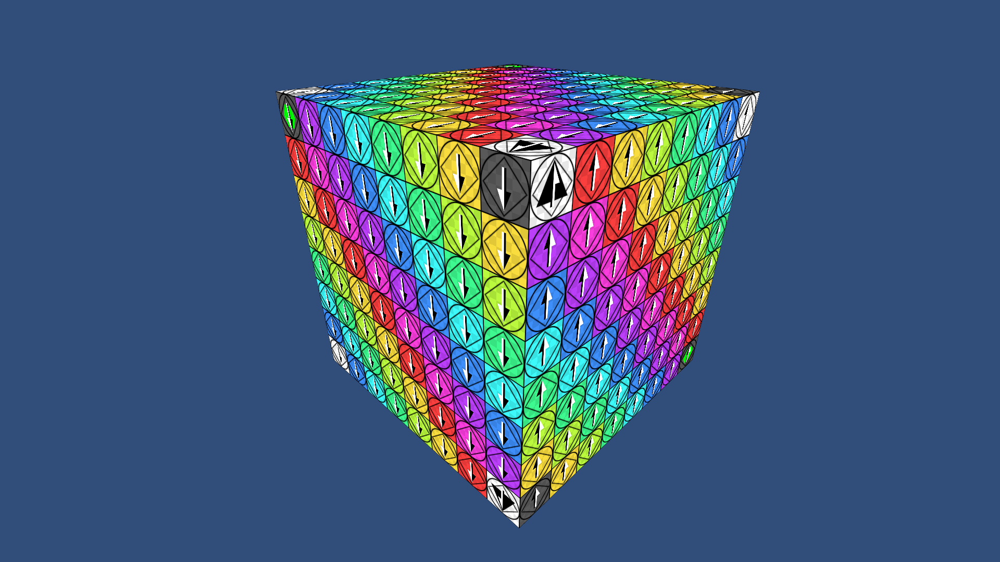
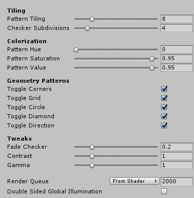
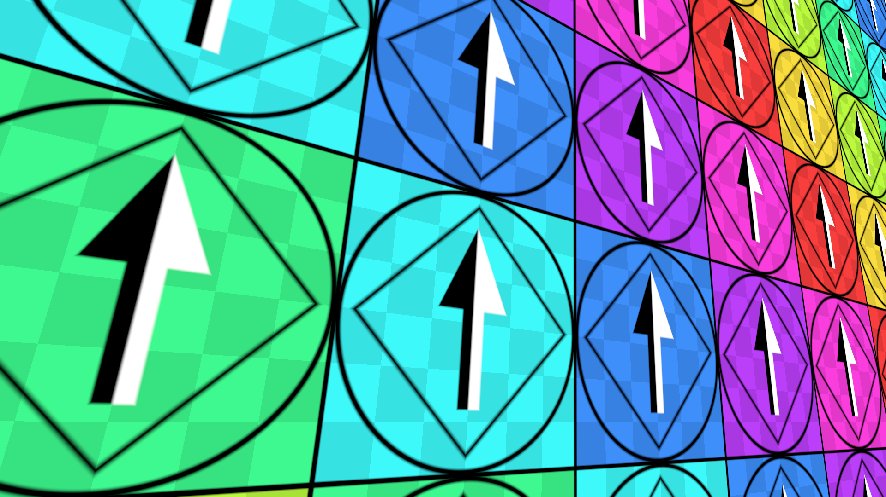
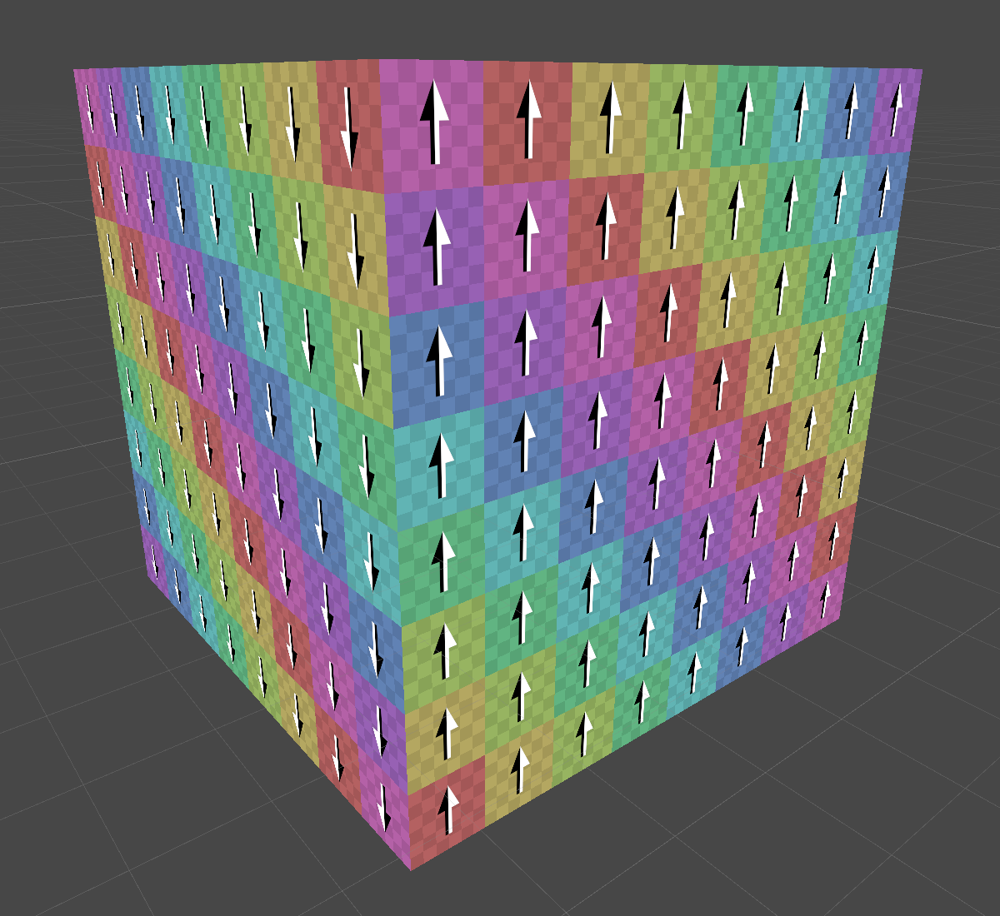
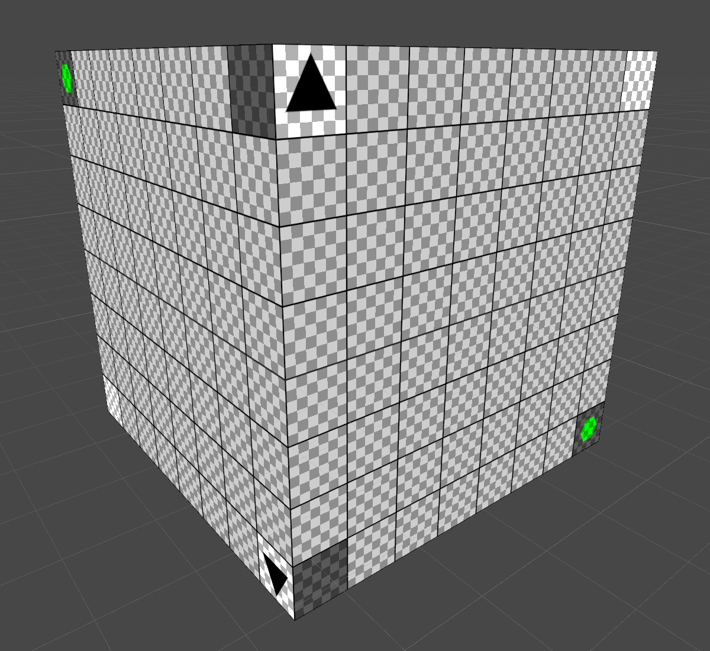

# UVDebugShader for Unity

This is one experiment I wanted to do - Write a procedural UV test texture, which would be a bit more resolution independent, without those nasty pixelation artifacts and so on. Needless to say it will eat a lot more GPU time than a texture.

Currently this is just a prototype and it's an unlit vert/frag shader.

It's written for Unity's built-in render pipeline.

I'd need to think about the details and balancing of many things, but this already has the things I usually need when I'm doing UV mapping.

## Features

- Adjustable pattern density

- Adjustable checker pattern density
    - Ability to fade the checker pattern

- Ability to toggle on/off different features
    - Corner markers
    - Grid
    - Aspect ratio circles
    - Aspect ratio diamonds
    - Direction arrows

- Adjust color pattern
    - Hue
    - Saturation
    - Value
    - Contrast
    - Gamma

## UI

I exposed some of the tweaks to the Inspector UI

## Shader in action

It's possible to tweak it to get different looks:

© 2020 Olli Sorjonen All Rights Reserved
